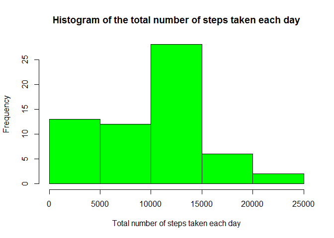
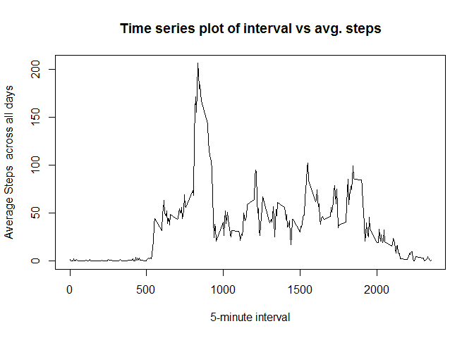
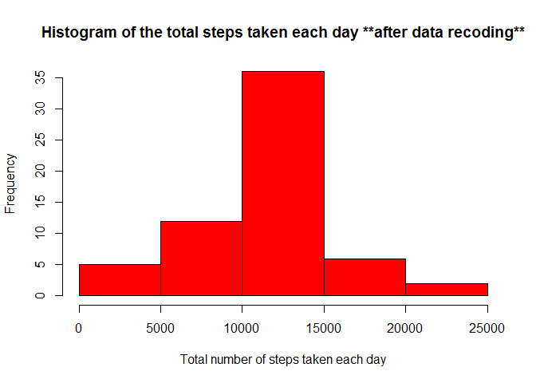
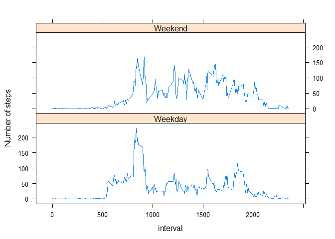

We would need below library files for our scripts

```r
suppressMessages(library(dplyr))   # suppress warnings during loading packages
library(ggplot2)
library(xtable)
library(lattice)
```

Below script set your working dirctory.

```r
setwd("E:/Coursera/git-folder/course5/RepData_PeerAssessment1")
 knitr::opts_chunk$set(fig.path = "./figure/")
```

Below script check if the data file present in local directory. As downloded from github, data should be present in local directory. 

```r
if (file.exists("activity.zip")) {
        unzip("activity.zip")
} else {
        stop("The activity data file is missing. Please save data in working directory")
}
```

## Loading and preprocessing the data

Load the data (i.e. read.csv())

```r
activity_data <- read.csv("./activity.csv", header=TRUE, sep = ",")
```

Below script can help to understand the data

```r
str(activity_data)
```

```
## 'data.frame':	17568 obs. of  3 variables:
##  $ steps   : int  NA NA NA NA NA NA NA NA NA NA ...
##  $ date    : Factor w/ 61 levels "2012-10-01","2012-10-02",..: 1 1 1 1 1 1 1 1 1 1 ...
##  $ interval: int  0 5 10 15 20 25 30 35 40 45 ...
```

So Steps and interval columns are intiger and Date column is saved as factor


```r
head(activity_data)
```

```
##   steps       date interval
## 1    NA 2012-10-01        0
## 2    NA 2012-10-01        5
## 3    NA 2012-10-01       10
## 4    NA 2012-10-01       15
## 5    NA 2012-10-01       20
## 6    NA 2012-10-01       25
```

We can see there are NA values in the data. So whenever require we will ignore the missing values using script ** na.rm = TRUE **. Lets explore few finidngs.

## What is mean total number of steps taken per day?

For this part of the assignment, we will ignore the missing values in the dataset. Steps are as follows

1. Calculate the total number of steps taken per day, and check the data how it looks

```r
Total_Steps <- with(activity_data, tapply(steps,date,sum,na.rm = TRUE) )
head(Total_Steps)
```

```
## 2012-10-01 2012-10-02 2012-10-03 2012-10-04 2012-10-05 2012-10-06 
##          0        126      11352      12116      13294      15420
```
2. Make a histogram of the total number of steps taken each day


```r
hist(Total_Steps, col = "green", main="Histogram of the total number of steps taken each day", xlab = "Total number of steps taken each day")
```

<!-- -->


3. Calculate and report the mean and median of the total number of steps taken per day


```r
Mean_Steps <- mean(Total_Steps)
Median_Steps <- median(Total_Steps)
```
So mean steps taken by user is 9354.2295082 and median of total steps is 10395.


## What is the average daily activity pattern?

For this first we arrange the data and calculate average per interval across all days.

```r
Avg_steps_per_interval = aggregate(steps ~ interval,data = activity_data, FUN = mean, na.rm = TRUE)
head(Avg_steps_per_interval)
```

```
##   interval     steps
## 1        0 1.7169811
## 2        5 0.3396226
## 3       10 0.1320755
## 4       15 0.1509434
## 5       20 0.0754717
## 6       25 2.0943396
```

Make a time series plot (i.e. type = "l") of the 5-minute interval (x-axis) and the average number of steps taken, 
averaged across all days (y-axis)


```r
plot(Avg_steps_per_interval$interval, Avg_steps_per_interval$steps, type="l", xlab = "5-minute interval", ylab = "Average Steps  across all days",main = "Time series plot of interval vs avg. steps")
```

<!-- -->

Calculate which 5-minute interval, on average across all the days in the dataset, contains the maximum number of steps?

```r
Avg_steps_per_interval[which.max(Avg_steps_per_interval$steps),]
```

```
##     interval    steps
## 104      835 206.1698
```

## Imputing missing values

Note that there are a number of days/intervals where there are missing values (coded as NA). The presence of missing days may introduce bias into some calculations or summaries of the data.

Calculate and report the total number of missing values in the dataset (i.e. the total number of rows with NAs)

```r
NA_activity_data <- sapply(activity_data, FUN = function(x) sum(is.na(x)))

NA_activity_data
```

```
##    steps     date interval 
##     2304        0        0
```

So we only have NA in steps column

Devise a strategy for filling in all of the missing values in the dataset. The strategy does not need to be sophisticated. For example, you could use the mean/median for that day, or the mean for that 5-minute interval, etc.

We will use mean for that 5-minute interval and Create a new dataset that is equal to the original dataset but with the missing data filled in.

```r
activity_data_1 <- group_by(activity_data,interval)

activity_data_1 <- mutate(activity_data_1,steps = replace(steps,is.na(steps),mean(steps,na.rm = TRUE)))
head(activity_data_1)
```

```
## # A tibble: 6 x 3
## # Groups:   interval [6]
##    steps date       interval
##    <dbl> <fct>         <int>
## 1 1.72   2012-10-01        0
## 2 0.340  2012-10-01        5
## 3 0.132  2012-10-01       10
## 4 0.151  2012-10-01       15
## 5 0.0755 2012-10-01       20
## 6 2.09   2012-10-01       25
```


Make a histogram of the total number of steps taken each day.


```r
Total_Steps2 <- with(activity_data_1, tapply(steps,date,sum,na.rm = TRUE) )

hist(Total_Steps2, col = "red", main="Histogram of the total steps taken each day **after data recoding**", xlab = "Total number of steps taken each day")
```

<!-- -->

And Calculate and report the mean and median total number of steps taken per day. 


```r
Mean_Steps2 <- mean(Total_Steps2)
Median_Steps2 <- median(Total_Steps2)
```

So after imputing missing data mean steps taken by user is 1.0766189\times 10^{4} and median of total steps is 1.0766189\times 10^{4}.

Do these values differ from the estimates from the first part of the assignment? What is the impact of imputing missing data on the estimates of the total daily number of steps?

Lets see the difference.

```r
mean_diff <- Mean_Steps2 - Mean_Steps
median_diff <- Median_Steps2 - Median_Steps
```

So the mean difference is 1411.959171 and median difference is 371.1886792. Yes, the difference is poitive and we also can see an increase in nymber after removing null value.


## Are there differences in activity patterns between weekdays and weekends?

For this part the weekdays() function may be of some help here. Use the dataset with the filled-in missing values for this part.

Create a new factor variable in the dataset with two levels -- "weekday" and "weekend" indicating whether a given date is a weekday or weekend day.


```r
activity_data_1$date <- as.Date(activity_data_1$date)
activity_data_1$dayname <- weekdays(activity_data_1$date)
activity_data_1$Daytype <- as.factor(activity_data_1$dayname == "Saturday" | activity_data_1$dayname == "Sunday")
levels(activity_data_1$Daytype) <- c("Weekday","Weekend")
```

We can cross check the data with below code.

```r
table(activity_data_1$dayname)
table(activity_data_1$Daytype)
```

Make a panel plot containing a time series plot (i.e. type = "l") of the 5-minute interval (x-axis) and the average number of steps taken, averaged across all weekday days or weekend days (y-axis). 


```r
Avg_steps_per_interval_1 = aggregate(steps ~ interval+Daytype,data = activity_data_1, FUN = mean, na.rm = TRUE)

xyplot(steps ~ interval | Daytype, data = Avg_steps_per_interval_1, type="l", layout = c(1,2), xlab = "interval", ylab = "Number of steps")
```

<!-- -->
